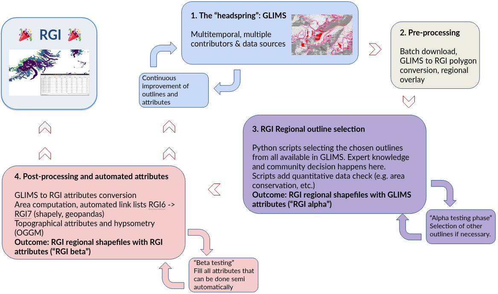

# Scripts used to generate the Randolph Glacier Inventory version 7

This is a work in progress.

## Pre-processing workflow

Notebooks in the `workflow` folder:

- Step 1: [Modify the RGI6 regions files for RGI7](workflow/01_rgi7_reg_files.ipynb): small updates to the RGI6 region files
- Step 2: [GLIMS region files download: Level 0 files](workflow/02_l0_download_from_glims.ipynb): download ALL outlines from the GLIMS servers, per region
- Step 3: [Convert GLIMS polygons to RGI polygons: Level 1 files](workflow/03_l1_interiors.ipynb): convert the polygons from the GLIMS to the RGI format
- Step 4: [Select glaciers within region shapes and basic attributes: Level 2 files](workflow/04_l2_select_and_zip.ipynb): a simple overlay to select only the relevant outlines for each region.

At the end of this workflow (L2 files), the shapes are ready for region per region outline selection.

## Regional outline selection workflow

Notebooks scripts are in the `outline_selection` folder.

The work-in-progress RGI7 alpha files are available for review in the `l3_rgi7a_tar` folder. Regions are being added regularly!

## Current data

The files at each level (in tar or shapefile format) are downloadable here:

https://cluster.klima.uni-bremen.de/~fmaussion/misc/rgi7_scripts/

Careful! The files might (and will) change with time

## License

Code: BSD3

Data (RGI): CC BY 4.0

 