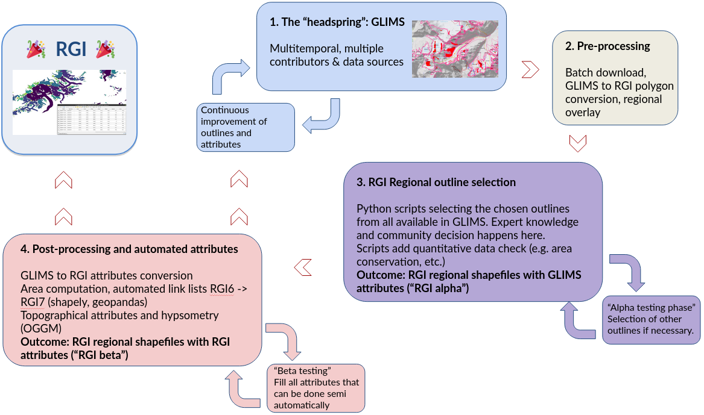

# Scripts used to generate the Randolph Glacier Inventory version 7

RGI7 is the next version of the Randolph Glacier Inventory. See https://www.glims.org/rgi_user_guide for a full documentation.

Unlike previous versions of the RGI, RGI7 is subset of the GLIMS database. This repository contains the scripts that generate RGI7 out of GLIMS. 

RGI7 is now published. Current work focusses on RGI7.1

Contributions and feedback welcome.

## 01. Pre-processing workflow

The preprocessing workflow downloads the GLIMS database into regional blocks, converts the GLIMS geometries to the RGI format, 
and prepares the outlines for the regional selection scripts.

Notebooks in the [workflow/preprocessing](workflow/preprocessing) folder:

- Step 1: [Modify the RGI6 regions files for RGI7](workflow/preprocessing/01_rgi7_reg_files.ipynb): small updates to the RGI6 region files
- Step 2: [GLIMS region files download: Level 0 files](workflow/preprocessing/02_l0_download_from_glims.ipynb): download ALL outlines from the GLIMS servers, per region
- Step 3: [Convert GLIMS polygons to RGI polygons: Level 1 files](workflow/preprocessing/03_l1_interiors.ipynb): convert the polygons from the GLIMS to the RGI format
- Step 4: [Select glaciers within region shapes and basic attributes: Level 2 files](workflow/preprocessing/04_l2_select_and_zip.ipynb): a simple overlay to select only the relevant outlines for each region.

## 02. Regional outline selection workflow

Regional notebooks scripts are in the [workflow](workflow) folder.

The RGI7 alpha files are available in https://cluster.klima.uni-bremen.de/~fmaussion/misc/rgi7_data/l3_rgi7a_tar.

They were reviewed by the community in 2023.

## 03. Attribute generation workflow

The postprocessing workflow cleans the files and adds attributes not available in the GLIMS database. The structure here is always the same for all 
regions, hence we wrote a template script and used papermill to apply it to all regions.

Notebooks in the [workflow/postprocessing](workflow/postprocessing) folder:

- [Alpha to beta](workflow/postprocessing/alpha_to_beta): compute glacier center point, assign subregions, assign RGI attributes names and types with [rgi7_attributes_metadata.json](workflow/postprocessing/rgi7_attributes_metadata.json), assign an RGI ID, assign UTM zone, add links to RGI6 (this includes [a bug](https://github.com/GLIMS-RGI/rgi_issue_tracker/issues/41)), extract the submission id information, compute the interesects, create the merged glacier complex product, and write everything out.
- [beta0 to beta1](workflow/postprocessing/beta0_to_beta1): add the hypsometry data
- [beta1 to beta2](workflow/postprocessing/beta1_to_beta2): add the centerline product
- [recompute_links_after_release](workflow/postprocessing/recompute_links_after_release): fix [the bug](https://github.com/GLIMS-RGI/rgi_issue_tracker/issues/41) mentioned earlier.

## RGI7.1

The scripts for RGI7.1 are bein added in the v7.1 folder. The 7.1 workflow starts from RGI7.0's official files and makes its way from there.

## License

Code: BSD3

Data (RGI): CC BY 4.0
